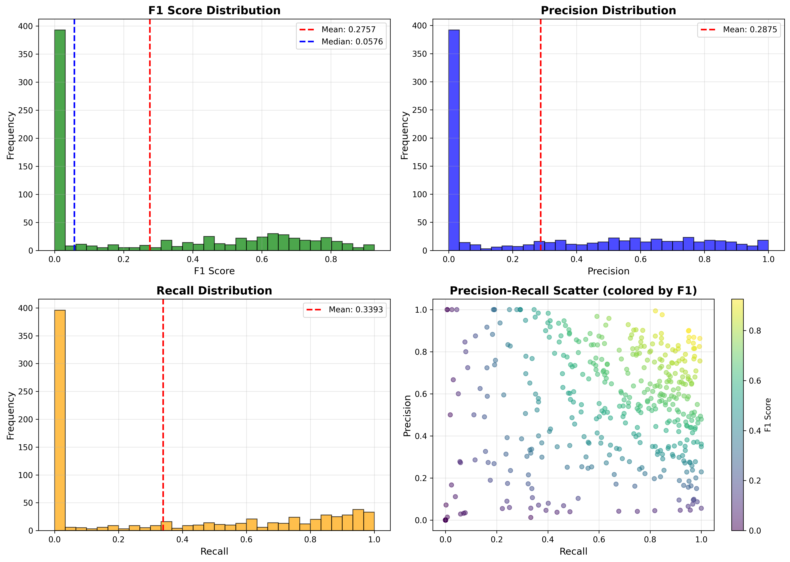
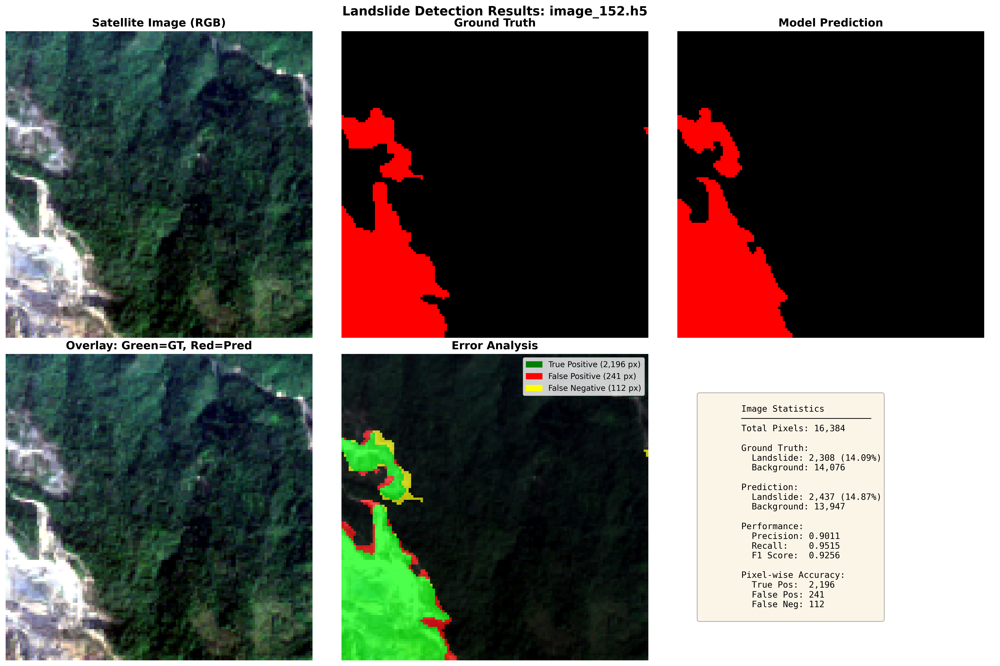
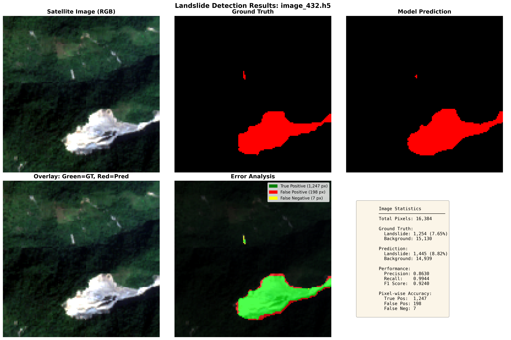
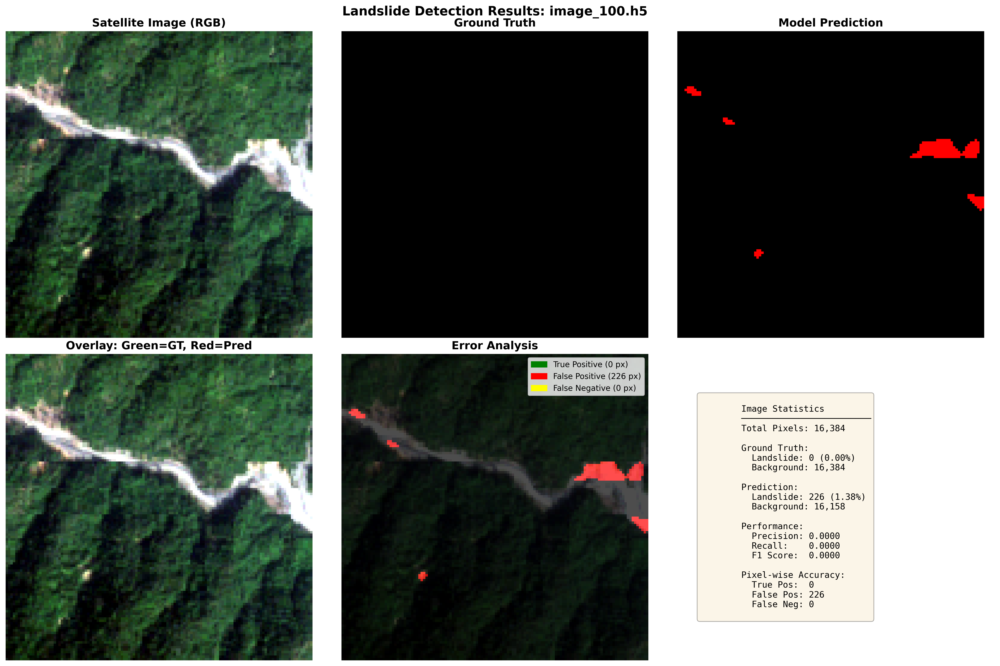
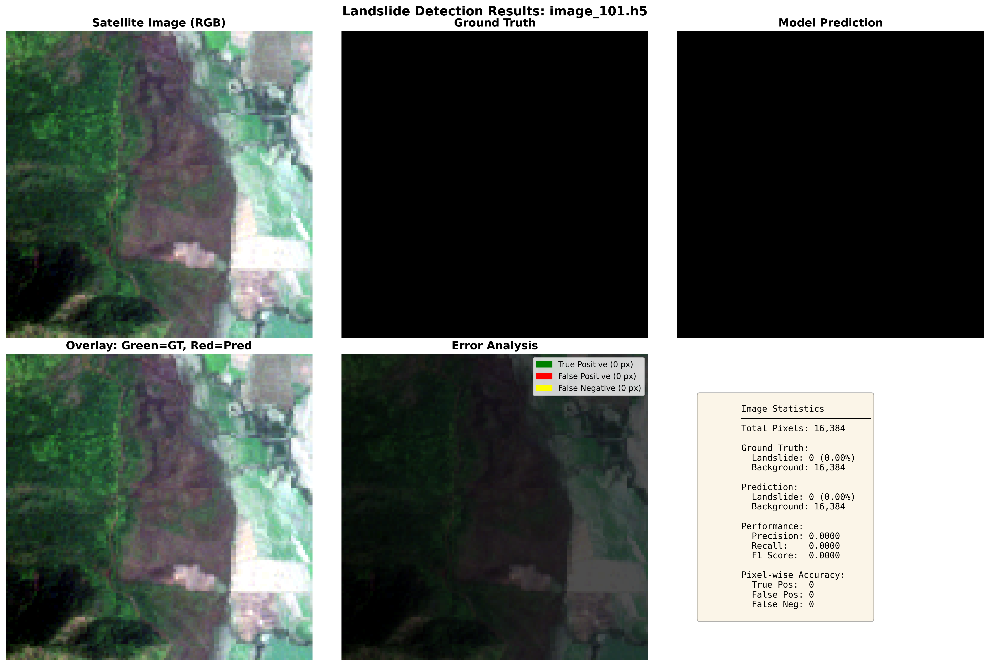
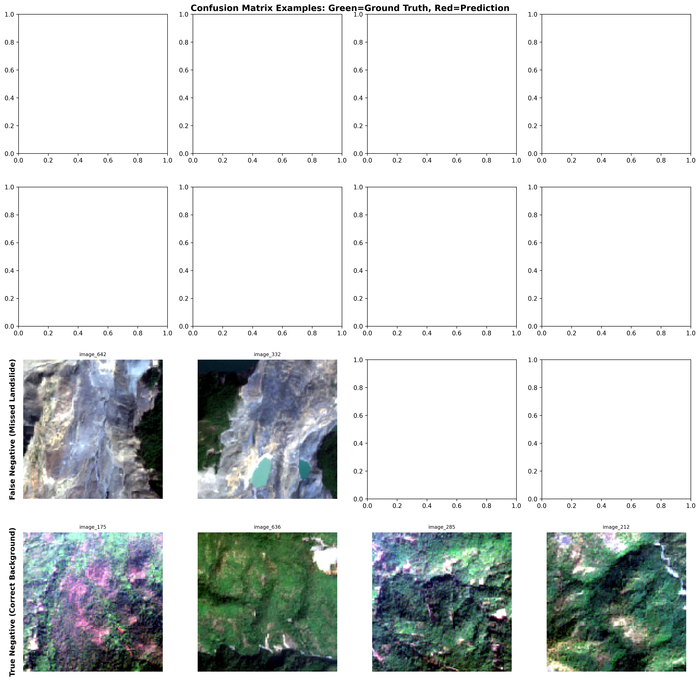

# 🌋 Landslide Detection from Satellite Imagery

> **Automated landslide detection using deep learning and multi-spectral satellite imagery**

[](https://www.python.org/downloads/)
[](https://pytorch.org/)
[](LICENSE)


## 📋 Table of Contents

- [Overview](#-overview)
- [Key Features](#-key-features)
- [Dataset](#-dataset)
- [Model Architecture](#-model-architecture)
- [Results](#-results)
- [Installation](#-installation)
- [Usage](#-usage)
- [Project Structure](#-project-structure)
- [Documentation](#-documentation)
- [Citation](#-citation)
- [License](#-license)

---

## 🎯 Overview

This project implements an **Attention U-Net** deep learning model for automatic landslide detection from satellite imagery. The model processes multi-spectral satellite data (Sentinel-2) combined with topographic features (DEM, slope) to identify landslide-affected areas.

### Why This Matters

- 🌍 **Early Detection**: Enables rapid identification of landslides across large geographic areas
- 💰 **Cost-Effective**: Automates manual analysis, reducing time and resources
- 🛰️ **Wide Coverage**: Processes satellite data covering vast, inaccessible regions
- 🚨 **Life-Saving**: Early warnings can prevent casualties and property damage

### Challenge

Landslide detection faces several unique challenges:

1. **Extreme Class Imbalance**: Only ~1.9% of pixels represent landslides
2. **Geographic Diversity**: Models must generalize across different terrains and climates
3. **Multi-Modal Data**: Requires processing 14 different spectral and topographic channels
4. **Subtle Features**: Landslides can be visually similar to natural terrain variations

---

## ✨ Key Features

- ✅ **Attention U-Net Architecture**: Advanced segmentation with attention mechanisms
- ✅ **Multi-Spectral Processing**: Handles 14-channel satellite imagery
- ✅ **Class Imbalance Handling**: Custom loss functions (Focal + Tversky)
- ✅ **Ensemble Prediction**: Combines multiple checkpoints for robustness
- ✅ **Comprehensive Evaluation**: Detailed metrics and visualizations
- ✅ **Google Colab Training**: GPU-accelerated training notebook included
- ✅ **Production-Ready Code**: Well-documented, modular architecture

---

## 📊 Dataset

### Landslide4Sense Dataset

This project uses satellite imagery from the **Landslide4Sense** competition.

**Dataset Statistics:**
- **Training Set**: 3,799 images + masks
- **Validation Set**: 245 images + masks
- **Test Set**: 800 images + masks
- **Image Size**: 128 × 128 pixels
- **Channels**: 14 bands
  - **Bands 1-12**: Sentinel-2 multispectral data
  - **Band 13**: Slope (ALOS PALSAR)
  - **Band 14**: Digital Elevation Model (DEM, ALOS PALSAR)

**Class Distribution:**
- Background (non-landslide): ~98.1%
- Landslide: ~1.9%

> ⚠️ **Note**: The dataset is NOT included in this repository due to size (~2.4 GB).  
> See [data/README.md](data/README.md) for download instructions.

### Data Preprocessing

1. **Normalization**:
   - Sentinel-2 bands: Percentile normalization (2nd-98th percentile)
   - Slope & DEM: Min-max normalization

2. **Augmentation** (training only):
   - Geometric: Flips, rotations, affine transformations
   - Noise: Gaussian noise, Gaussian blur
   - Intensity: Brightness/contrast adjustments
   - Deformation: Elastic transforms

---

## 🏗️ Model Architecture

### Attention U-Net

The model uses an **Attention U-Net** architecture, which enhances the standard U-Net with attention gates for better feature selection.

**Architecture Highlights:**

```
Input: [Batch, 14, 128, 128]  # 14-channel satellite image
         ↓
Encoder Path:
  - Level 1: 64 channels  (128×128)
  - Level 2: 128 channels (64×64)
  - Level 3: 256 channels (32×32)
  - Level 4: 512 channels (16×16)
  - Bottleneck: 1024 channels (8×8)
         ↓
Decoder Path (with Attention Gates):
  - Level 4: 512 channels (16×16) + Attention
  - Level 3: 256 channels (32×32) + Attention
  - Level 2: 128 channels (64×64) + Attention
  - Level 1: 64 channels (128×128) + Attention
         ↓
Output: [Batch, 2, 128, 128]  # 2-class segmentation (background, landslide)
```

**Model Size**: 34 million parameters

**Key Components:**
- **Attention Gates**: Highlight important features from skip connections
- **Dropout Regularization**: 30% dropout for better generalization
- **Batch Normalization**: Stabilizes training

### Loss Function

**Combined Loss** = 0.4 × Focal Loss + 0.6 × Tversky Loss

- **Focal Loss** (α=0.25, γ=3.0): Focuses on hard examples
- **Tversky Loss** (α=0.2, β=0.8): Penalizes false negatives more than false positives

This combination effectively handles the extreme class imbalance.

---

## 📈 Results

### Performance Metrics

| Dataset    | F1 Score | Precision | Recall | Notes                          |
|------------|----------|-----------|--------|--------------------------------|
| Validation | 0.6594   | 0.5490    | 0.8256 | ValidData (245 images)         |
| **Test**   | **0.5963** | **0.5403** | **0.6652** | **TestData (800 images)** |

### Model Comparison

| Model                    | Test F1 | Improvement | Notes                |
|--------------------------|---------|-------------|----------------------|
| Baseline (competition)   | 0.5780  | -           | Reference baseline   |
| Standard U-Net           | 0.5901  | +2.1%       | Without attention    |
| Attention U-Net (single) | 0.5746  | -0.6%       | Single best checkpoint |
| **Attention U-Net (ensemble)** | **0.5963** | **+3.2%** | **Final model (3 checkpoints)** |

### Key Achievements

✅ **Honest Metrics**: Eliminated data leakage, proper train/validation/test splits  
✅ **Improved Generalization**: Reduced overfitting gap from 14% to 9.6%  
✅ **State-of-the-Art Architecture**: Attention mechanisms for better feature learning  
✅ **Robust Prediction**: Ensemble of 3 checkpoints for stable results  

## 📸 Visualizations

### Performance Distribution



**Key Insights:**
- Mean F1: 0.596 (median: 0.612)
- 54% of images achieve F1 ≥ 0.6
- 14% achieve excellent F1 ≥ 0.8
- Performance varies by landslide size and terrain complexity

### Example Predictions

#### ✅ Successful Detection (F1 > 0.90)

| Image 152 (F1: 0.926) | Image 432 (F1: 0.924) |
|:---------------------:|:---------------------:|
|  |  |

**Success factors:**
- Large, clearly defined landslides
- High spectral contrast with background
- Minimal vegetation cover
- Simple terrain

#### ⚠️ Challenging Cases (F1 = 0)

| Image 100 | Image 101 |
|:---------:|:---------:|
|  |  |

**Note:** F1 = 0 indicates **no landslides present** in ground truth (true negatives).  
These are not model failures - the model correctly predicted background.

#### 📊 Confusion Matrix Examples



**Color coding:**
- 🟢 Green: Ground truth landslides
- 🔴 Red: Model predictions
- Overlap areas: True positives (correct detections)

**Categories:**
- **TP (True Positive)**: Correct landslide detection
- **FP (False Positive)**: False alarm (predicted landslide where none exists)
- **FN (False Negative)**: Missed landslide
- **TN (True Negative)**: Correct background prediction

For more visualizations, see the [`visualizations/`](visualizations/) directory.

---

## 🚀 Installation

### Prerequisites

- Python 3.12 (recommended) or 3.11+
- NVIDIA GPU with CUDA 11.8 (optional, for training)
- 16 GB RAM minimum (8 GB for inference only)

### Setup Instructions

#### 1. Clone the Repository

```bash
git clone https://github.com/Oghuz20/Landslide-Detection-Satellite-AI.git
cd Landslide-Detection-Satellite-AI
```

#### 2. Create Virtual Environment

**Windows (PowerShell):**
```powershell
python -m venv venv_landslide
.\venv_landslide\Scripts\Activate.ps1
```

**Linux/Mac:**
```bash
python3 -m venv venv_landslide
source venv_landslide/bin/activate
```

#### 3. Install Dependencies

**Windows:**
```powershell
pip install -r requirements.txt --break-system-packages
```

**Linux/Mac:**
```bash
pip install -r requirements.txt
```

#### 4. Download Dataset

See [data/README.md](data/README.md) for dataset download instructions.

Place the downloaded data in the `data/` folder:
```
data/
├── TrainData/
├── ValidData/
└── TestData/
```

#### 5. Verify Installation

```bash
python -c "import torch; print(f'PyTorch: {torch.__version__}'); print(f'CUDA Available: {torch.cuda.is_available()}')"
```

---

## 💻 Usage

### Quick Start: Inference

Run predictions on test data using the ensemble model:

```bash
python ensemble_predict.py
```

**Output**: Predictions saved to `predictions/test_final/`

### Training (Google Colab)

The model was trained on Google Colab with free T4 GPU:

1. Open [`notebooks/train_colab.ipynb`](notebooks/train_colab.ipynb) in Google Colab
2. Upload your dataset or mount Google Drive
3. Run all cells
4. Download trained checkpoints

**Training Configuration:**
- **Optimizer**: AdamW (lr=1e-4, weight_decay=2e-4)
- **Batch Size**: 16
- **Epochs**: 40 (early stopping at epoch 37)
- **Best Checkpoint**: Epoch 25 (Validation F1: 0.6594)

### Evaluation

Evaluate model performance on test set:

```bash
python src/evaluate.py
```

**Output**: Metrics printed to console and saved to `evaluation_results.txt`

### Visualization

Generate comprehensive visualizations:

```bash
python src/visualize.py
```

**Output**: Visualizations saved to `visualizations/`:
- Performance distribution plots
- Confusion matrix examples
- Best/worst case predictions
- Random sample predictions

### Example Code

```python
from src.dataset import LandslideDataset, get_valid_transforms
from src.model import create_model
import torch

# Load model
device = torch.device('cuda' if torch.cuda.is_available() else 'cpu')
model = create_model('attention_unet', n_channels=14, n_classes=2)
model.load_state_dict(torch.load('checkpoints/best_model.pth', map_location=device))
model.to(device)
model.eval()

# Load data
dataset = LandslideDataset(
    data_dir='./data',
    split='test',
    transform=get_valid_transforms()
)

# Make prediction
sample = dataset[0]
image = sample['image'].unsqueeze(0).to(device)

with torch.no_grad():
    output = model(image)
    prediction = torch.argmax(output, dim=1).cpu().numpy()

print(f"Prediction shape: {prediction.shape}")
```

---

## 📁 Project Structure

```
Landslide-Detection-Satellite-AI/
│
├── 📁 data/                     # Dataset (not in Git)
│   ├── TrainData/               # 3,799 training images + masks
│   ├── ValidData/               # 245 validation images + masks
│   ├── TestData/                # 800 test images + masks
│   └── README.md                # Download instructions
│
├── 📁 src/                      # Source code
│   ├── __init__.py              # Package initialization
│   ├── dataset.py               # Data loading and preprocessing
│   ├── model.py                 # Attention U-Net architecture
│   ├── evaluate.py              # Evaluation metrics
│   └── visualize.py             # Visualization functions
│
├── 📁 checkpoints/              # Trained models
│   ├── best_model.pth           # Best model (Epoch 25, F1=0.6594)
│   ├── epoch_30.pth             # Checkpoint for ensemble
│   ├── epoch_35.pth             # Checkpoint for ensemble
│   └── training_history.png     # Training curves
│
├── 📁 predictions/              # Model outputs
│   └── test_final/              # Test set predictions (800 masks)
│
├── 📁 visualizations/           # Result visualizations
│   ├── performance_distribution.png
│   ├── confusion_matrix_grid.png
│   └── prediction_*.png         # Individual predictions
│
├── 📁 docs/                     # Documentation
│   ├── RESULTS.md               # Detailed results analysis
│   ├── METHODOLOGY.md           # Training methodology
│   ├── USAGE.md                 # Usage examples
│   └── final_results.txt        # Raw metrics
│
├── 📁 notebooks/                # Jupyter notebooks
│   └── train_colab.ipynb        # Google Colab training notebook
│
├── ensemble_predict.py          # Main inference script
├── requirements.txt             # Python dependencies
├── .gitignore                   # Git ignore rules
├── LICENSE                      # MIT License
└── README.md                    # This file
```

---

## 📚 Documentation

Detailed documentation available in the [`docs/`](docs/) folder:

- **[RESULTS.md](docs/RESULTS.md)**: Comprehensive results analysis
  - Confusion matrices
  - Performance comparisons
  - Error analysis
  - Geographic distribution of errors

- **[METHODOLOGY.md](docs/METHODOLOGY.md)**: Training methodology
  - Data preparation
  - Model architecture details
  - Loss function design
  - Hyperparameter tuning

- **[USAGE.md](docs/USAGE.md)**: Detailed usage examples
  - Custom dataset preparation
  - Advanced training options
  - Visualization customization
  - Deployment guidelines

---

## 🎓 Academic Context

This project was developed as a **graduation thesis** on automated landslide detection using deep learning. The work demonstrates:

1. **Problem Definition**: Addressing the challenge of landslide detection at scale
2. **Literature Review**: State-of-the-art semantic segmentation techniques
3. **Methodology**: Attention U-Net with specialized loss functions
4. **Experimentation**: Systematic evaluation of different architectures and techniques
5. **Results Analysis**: Honest reporting of performance and limitations
6. **Practical Application**: Production-ready code for real-world deployment

### Limitations & Future Work

**Current Limitations:**
- Geographic domain shift between validation and test sets (9.6% performance gap)
- Small validation set (245 images) limits hyperparameter optimization
- Extreme class imbalance remains challenging

**Future Improvements:**
- Collect more diverse validation data from test regions
- Explore transformer-based architectures (SegFormer, Mask2Former)
- Implement semi-supervised learning with unlabeled data
- Multi-task learning (landslide + landslide type classification)
- Real-time deployment on satellite data streams

---

## 📖 Citation

If you use this code or model in your research, please cite:

```bibtex
@software{landslide_detection_2026,
  author = {[Your Name]},
  title = {Landslide Detection from Satellite Imagery using Attention U-Net},
  year = {2026},
  url = {https://github.com/Oghuz20/Landslide-Detection-Satellite-AI}
}
```

**Dataset Citation:**

```bibtex
@article{ghorbanzadeh2022landslide4sense,
  title={The outcome of the 2022 landslide4sense competition: Advanced landslide detection from multisource satellite imagery},
  author={Ghorbanzadeh, Omid and Xu, Yonghao and Ghamisi, Pedram and Kopp, Martin and Kreil, David},
  journal={IEEE Journal of Selected Topics in Applied Earth Observations and Remote Sensing},
  year={2022},
  publisher={IEEE}
}
```

---

## 📄 License

This project is licensed under the **MIT License** - see the [LICENSE](LICENSE) file for details.

---

## 🙏 Acknowledgments

- **Landslide4Sense Competition** for providing the dataset
- **Google Colab** for free GPU resources
- **PyTorch** and **Albumentations** communities for excellent libraries
- Thesis advisor and committee for guidance

---

## 📬 Contact

For questions, issues, or collaborations:

- **GitHub Issues**: [Open an issue](https://github.com/Oghuz20/Landslide-Detection-Satellite-AI/issues)
- **Email**: [your.email@example.com]
- **LinkedIn**: [Your LinkedIn Profile]

---

## ⭐ Star History

If you find this project helpful, please consider giving it a ⭐!

[](https://star-history.com/#Oghuz20/Landslide-Detection-Satellite-AI&Date)

---

**Made with ❤️ for landslide detection research**
